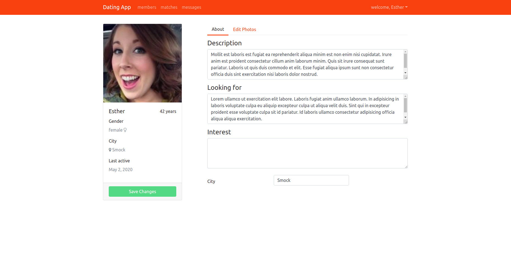

# Dating App

The following is a web application develop on .NET Core and angular, that enables the user to:

-   Register / Login as a user of the web app.
-   Implements the **Authentication** and **Authorization** based pn JWT Tokens.
-   Persistance of data thanks to sql database and .NET backend API.
-   message other members thanks to _SignalR_.
-   Implements a secure storage for images thanks to _Cloudinary_ API.

  

## Members tab

  

## Profile settings

  

